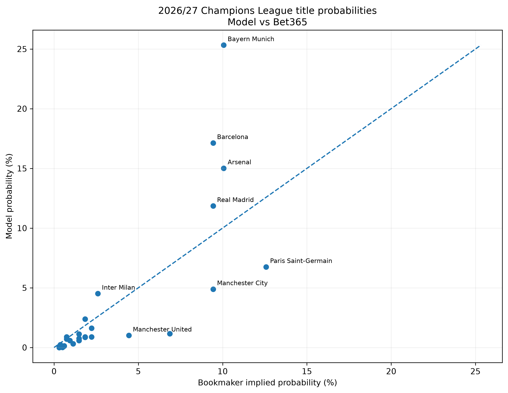
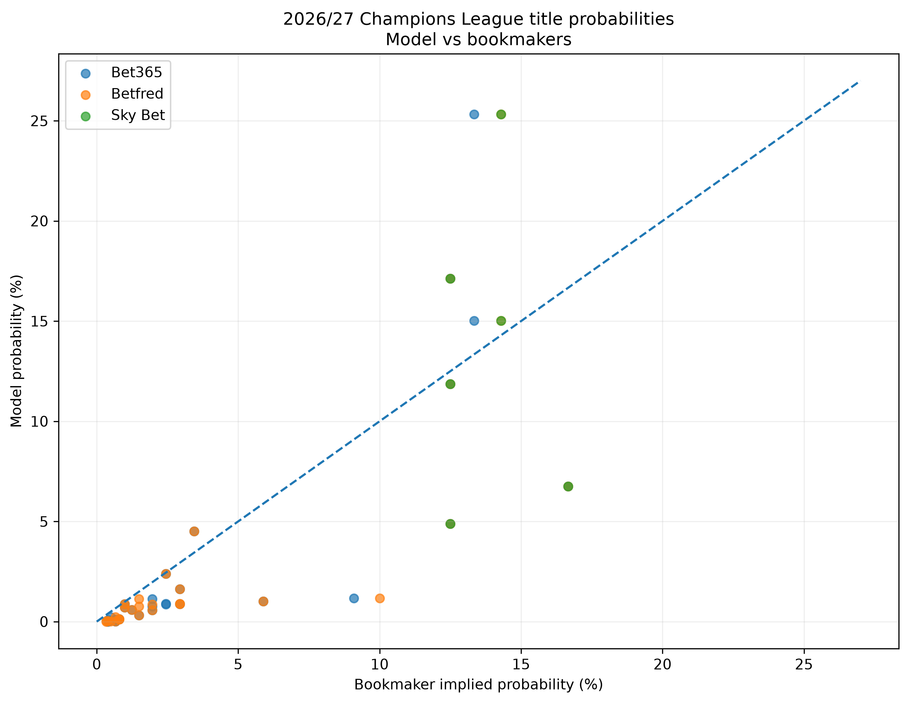

# Manchester United Champions League Predictor

Estimating Manchester United's probability of winning the 2026/27 UEFA Champions League.

The model uses historical match results to calculate team strength (Elo), predicts match scores using Poisson regression, and simulates the full Champions League tournament.

## Method

The project consists of three parts:

1. Calculate Elo ratings for each team
2. Fit a Poisson regression model for expected goals
3. Simulate the full 2026/27 Champions League

### Elo

Historical results from 2015/16 to 2025/26 are used to produce an Elo rating for each team.

A K factor of 20 is used throughout for the Elo calculation.

One issue with using domestic results is that teams from different leagues cannot initially be compared directly. To account for this, ratings are initialised based on average ClubElo ratings for each domestic league at the start of the dataset.

The Elo ratings are then updated chronologically using all available domestic and Champions League results.

### Poisson model

Expected goals are modelled via Poisson regression.

The model takes two inputs:

- Elo difference between the two teams
- Home advantage

For a team in a given match:

$$
\log(\lambda) = \beta_0 + \beta_1(\text{Elo difference}) + \beta_2(\text{Home})
$$

where $\lambda$ is the expected number of goals scored.

The model was tested on unseen seasons (2024/2025 and 2025/26) before being refitted using the full historical dataset.

On the initial validation season, mean Poisson deviance was:

- Constant model: 1.2703
- Home advantage only: 1.2535
- Elo + home advantage: 1.1036,

suggesting that Elo difference provides useful predictive information beyond a baseline or a solely home advantage based model.

### Tournament simulation

The complete 2026/27 Champions League is simulated. Despite the focus being on Manchester United's probability, we still observe the full data. We simulate the draws and rounds as accurately as possible.

This includes:

- Qualifying playoffs
- UEFA coefficient based pots
- League phase draw conditional on restricionts
- Full 36 team league phase
- League ranking and tiebreakers
- Knockout playoffs
- Round of 16
- Quarter finals
- Semi finals
- Final

League phase draws are generated subject to the UEFA restrictions on opponents, pots and domestic associations.

Individual match scores are sampled from the fitted Poisson model.

Two-legged ties are decided on aggregate, followed by extra time and penalties where required. Penalty shootouts are modelled as 50/50.

## Results

The final results are based on 100,000 simulated Champions League tournaments.

Manchester United won 1,006 of these tournaments, giving an estimated title probability of 1.006%, or approximately 1.0%.

The strongest teams in the simulation were:

| Team | Title probability |
|---|---:|
| Bayern Munich | 25.324% |
| Barcelona | 17.127% |
| Arsenal | 15.012% |
| Real Madrid | 11.856% |
| Paris Saint-Germain | 6.746% |
| Manchester City | 4.887% |
| Inter Milan | 4.512% |
| Borussia Dortmund | 2.390% |
| Atletico Madrid | 1.620% |
| Liverpool | 1.159% |
| Manchester United | 1.006% |

The results are generally reasonable, with stronger rated teams winning more often. However, the model appears more confident in some historically strong teams than one would expect in practice.

In particular, Bayern Munich win around a quarter of all simulated tournaments. Given the level of uncertainty and randomness in a knockout competition, this seems unusually dominant.

## Bookmaker comparison

The model probabilities can also be compared with current bookmaker Champions League outright odds.

The first plot compares the model directly with Bet365. 

The comparison shows some notable differences. Bayern Munich, Barcelona and Arsenal are considerably more strongly favoured by the modelm, whereas PSG, Manchester City, Liverpool and Manchester United are more strongly favoured by the bookmaker. 

The second plot compares the model against several bookmakers.

The same broad pattern remains. The model concentrates more of the total probability on a small number of its highest rated teams, while bookmaker probabilities are more spread across the field.

This comparison is useful because bookmakers incorporate information that is deliberately absent from this model, including current squads, transfers, injuries and market expectations.

It also highlights a difference in what the two approaches are measuring. The model is primarily based on long term historical results, whereas bookmaker prices attempt to reflect the expected strength of each team now.

## Limitations

The aim of the model was to keep the number of assumptions and inputs relatively small. Whislt this does make it easier to understand and build, it leaves out a large amount of salient information that could affect the tournament.

Some important limitations are:

- Elo is heavily influenced by long term historical performance. It may respond too slowly to sudden changes in team strength (as seen in PSG's low rating)
- Domestic league matches make a majority of the historical dataset. Strong long term domestic performance therefore has a large influence on a team's rating (as seen in Bayern Munich's dominance)
- The model has no direct measure of recent form
- Transfers and changes to the 2026/27 squads are not included
- Injuries and squad depth are not included
- Managerial and tactical changes are not included
- Playing styles and specific team matchups are not considered
- Champions League performance is not treated as a separate type of team strength
- Penalty shootouts are modelled as 50/50
- Teams with limited historical data have less reliable Elo ratings
- Goals for the two teams are modelled independently
- The Poisson model allows expected goals to continue increasing exponentially as Elo difference increases. This may make very strong teams too dominant against much weaker opposition

The last point is particularly relevant. We can see from the bookmaker comparisons that the model places more probability on a small number of very strong teams, while much of the remaining field is estimated lower.

Bayern Munich received a 25.3% title probability, which is unusually high for a competition with this much knockout uncertainty. Large Elo differences may therefore be producing overly decisive match probabilities, and the model doesn't sufficiently account for "upsets".

There are likely two effects contributing to this. Firstly, Bayern are given a very strong Elo due to their sustained historical and domestic performance. Secondly, once a large Elo difference exists, the Poisson model can produce increasingly large differences in expected goals.

## Interpretation

The model should not be interpreted as a complete estimate of a team's true probability of winning the Champions League, rather, it better answers the question: \

"How often would each team win the tournament if team strength were represented by historical Elo ratings, and match scores followed the fitted Elo and home advantage Poisson model?"

Hence, teams whose current squad is substantially stronger than their recent historical performance may be underrated. Teams with very strong long term domestic records may be overrated.

The disagreement between the model and the market could therefore be seen as useful in itself, as it shows which information the simple historical model is failing to capture.

## Notebooks

The project spans 3 notebooks: 

`01_elo_exploration.ipynb`

Investigates the Elo system, starting ratings and choice of K

`02_poisson_ml_model.ipynb`

Builds and checks the regression model

`03_cl_simulations.ipynb`

Implements the 2026/27 Champions League format and runs the simulations

## Tools

The project is written in Python and uses:

- pandas
- NumPy
- statsmodels
- SQLite
- soccerdata
- matplotlib